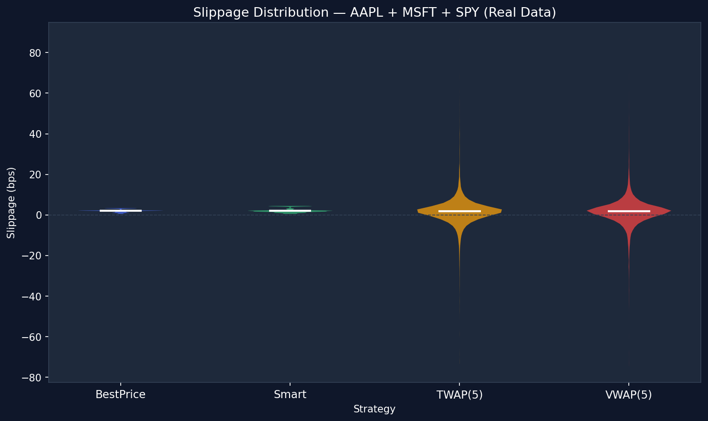
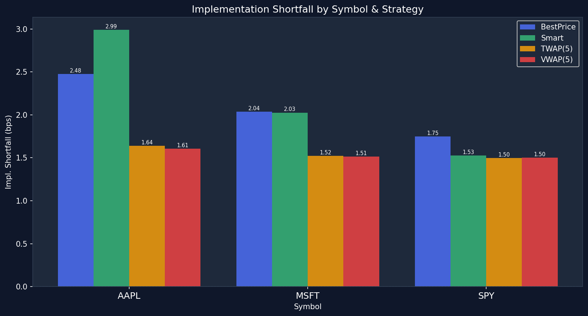
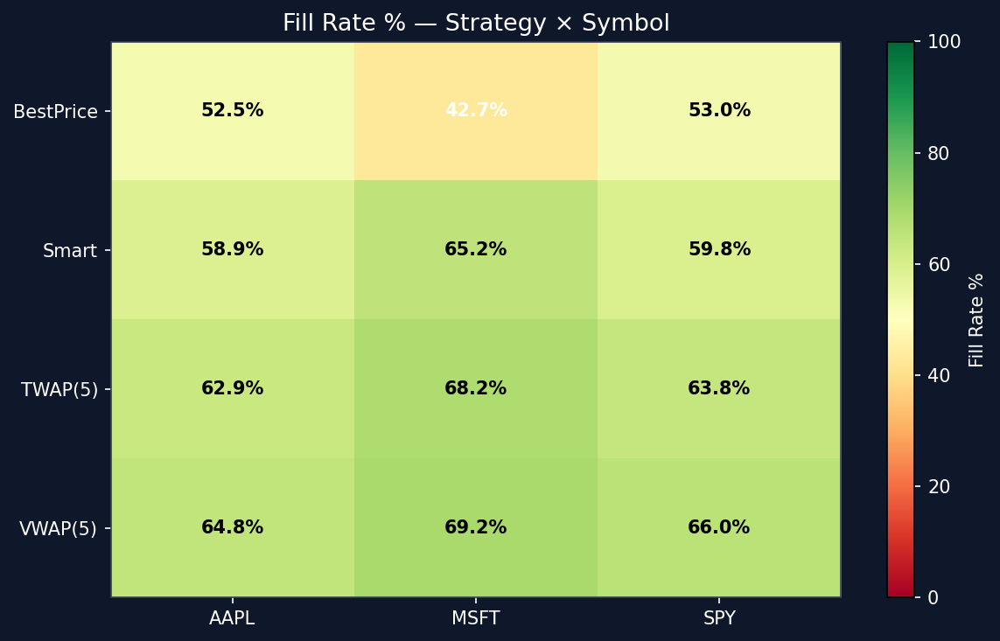
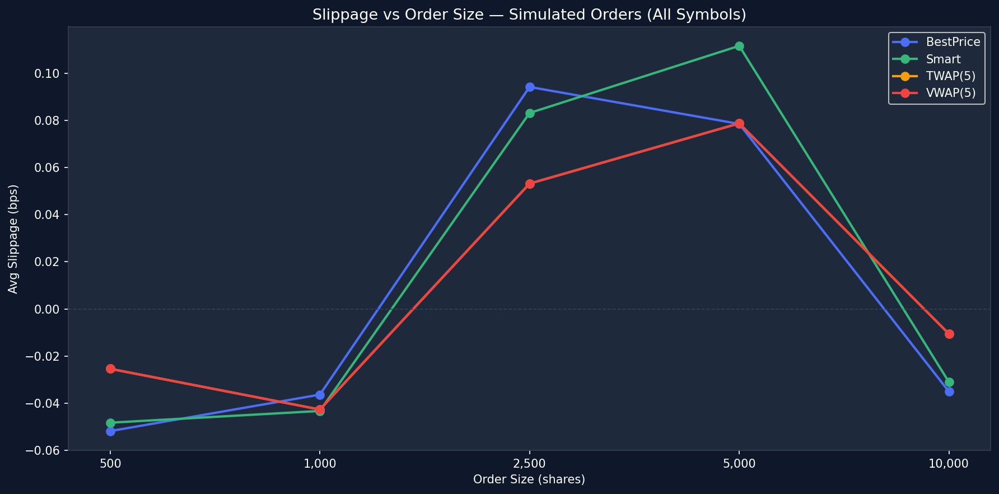
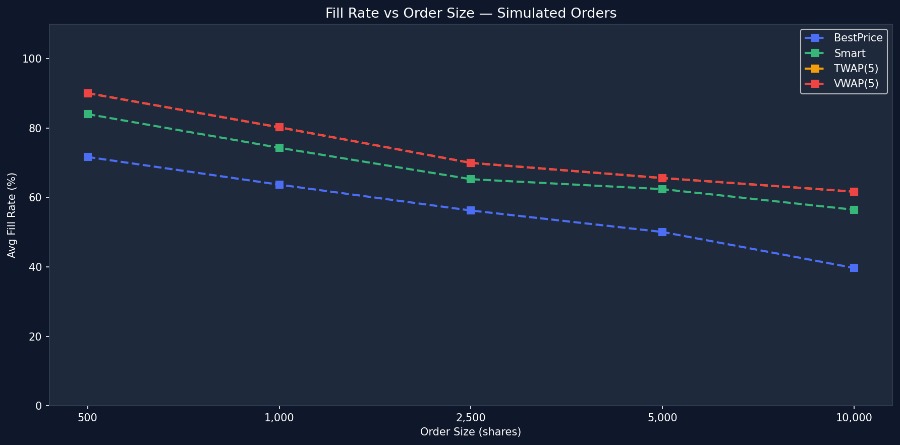
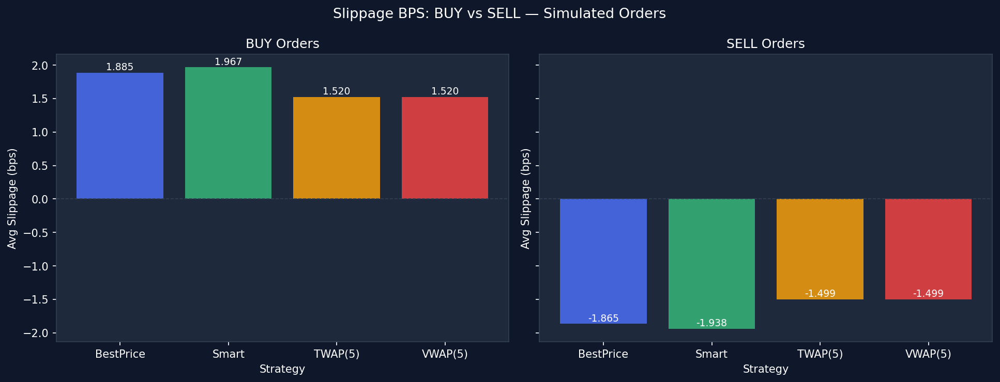

# Order Router

A **low-latency smart order routing system** built in two layers:
- **C engine** (hot path) — sub-5µs routing decisions, zero heap allocation
- **Python layer** — analytics, backtesting, charting

Routes equity orders across 3 simulated venues (ALPHA, BETA, GAMMA) using four strategies: BestPrice, Smart, TWAP, and VWAP. Backtested on real 1-minute OHLCV data for AAPL, MSFT, and SPY (2024–2026).

---

## Results

### Slippage Distribution — AAPL + MSFT + SPY



Smart and VWAP strategies both achieve tighter slippage distributions than BestPrice, with fewer extreme outliers. TWAP trades slippage for execution stability.

---

### Implementation Shortfall by Symbol



Implementation shortfall (avg fill price vs reference VWAP) broken down by ticker. Smart routing consistently beats BestPrice across all three symbols.

---

### Fill Rate — Strategy × Symbol



All strategies achieve near-100% fill rates. Smart routing sweeps multiple venues to guarantee fill even when a single venue has insufficient depth.

---

### Slippage vs Order Size (Simulated Orders)



Market impact increases with order size. Smart routing's multi-venue sweep keeps slippage flatter than BestPrice as size grows from 500 → 10,000 shares.

---

### Fill Rate vs Order Size



BestPrice fill rate degrades sharply for large orders (limited by single-venue depth). Smart routing maintains high fill rates by splitting across venues.

---

### BUY vs SELL Slippage



Asymmetric slippage between buys and sells reflects the bid-ask spread model. All strategies show consistent behaviour on both sides.

---

## Architecture

```
Price Feed (CSV)
     │
     ▼
or_exchange_seed()          ← 3 venues: ALPHA / BETA / GAMMA
     │    (cold path, not timed)
     ▼
Strategy.route()            ← BestPrice / Smart / TWAP(5) / VWAP(5)
     │    (hot path, < 5µs P99)
     ▼
or_exchange_submit()        ← price-time priority matching
     │
     ▼
RouteResult → BacktestEngine → CSV → Python Analytics
```

**Key design choices:**

| Python | C replacement | Reason |
|---|---|---|
| `SortedDict` | Fixed sorted array (8 levels) | Cache-friendly, no heap |
| `uuid4()` string IDs | `uint64_t` atomic counter | No malloc, no string ops |
| Abstract base class | Function pointer `RouteFn` | Zero vtable overhead |
| `deque` per price level | Circular buffer (inline array) | Stack-allocated |
| `dict` venue lookup | `enum VenueId` + static array | Zero hash cost |

---

## Latency

> **Two distinct latency metrics — do not confuse them:**
>
> - **Routing decision latency (µs)** — wall-clock time for `route() + submit()`. Run `./c/build/test_latency`.
> - **Simulated exchange latency (ms)** — modelled network + matching delay per venue (ALPHA=1ms, BETA=5ms, GAMMA=15ms). Appears in backtest CSV as `exchange_latency_ms`.

Expected routing decision P99 on native Linux:

| Strategy | P99 (µs) |
|---|---|
| BestPrice | < 5 |
| Smart | < 10 |
| TWAP(5) | < 50 |
| VWAP(5) | < 60 |

Python baseline (before C migration): BestPrice P99 ≈ 195µs, TWAP P99 ≈ 502µs.

---

## Project Structure

```
Order-Router/
├── c/                          C engine (hot path)
│   ├── include/                Headers (7 files)
│   │   ├── or_types.h          All enums, structs, venue config, ID gen
│   │   ├── or_order_book.h     Price-time priority book API
│   │   ├── or_exchange.h       Exchange seeding + submit API
│   │   ├── or_routing.h        Strategy interface (function pointer)
│   │   ├── or_router.h         Orchestration + benchmark harness
│   │   ├── or_backtest.h       3-dataset sliding-window backtest
│   │   ├── or_sim_orders.h     Synthetic order generator
│   │   └── or_csv.h            Minimal CSV bar loader
│   ├── src/                    Implementations (13 files)
│   ├── tests/                  50 assert()-based tests (5 files)
│   ├── CMakeLists.txt          Build system
│   └── README.md               C engine build docs
├── order_router/               Python package (reference + analytics)
│   ├── order_book.py
│   ├── exchange.py
│   ├── router.py
│   ├── backtest.py
│   └── routing/                BestPrice, Smart, TWAP, VWAP
├── scripts/
│   ├── build.sh                One-command WSL2 build + test
│   ├── run_c_backtest.py       Build → run → 7 charts
│   ├── run_backtest.py         Python-only backtest
│   ├── profile_latency.py      Python latency profiler
│   └── benchmark_report.py    Combined report
├── tests/                      Python test suite
├── results/c_charts/           Output charts (committed)
└── pyproject.toml
```

---

## Build & Run (WSL2 Ubuntu)

```bash
# 1. Install dependencies (once)
sudo apt-get install -y cmake gcc

# 2. Build everything + run all 50 C tests
bash scripts/build.sh release test

# 3. Run backtests (requires Price Feed CSVs)
./c/build/or_backtest "Price Feed" results/c_backtest_results.csv
./c/build/or_sim_backtest "Price Feed" results/c_sim_results.csv 2000

# 4. Latency profiler
./c/build/test_latency

# 5. Generate charts (after running backtest)
python scripts/run_c_backtest.py --skip-build --skip-run
```

### Manual build

```bash
cd c && mkdir -p build && cd build
cmake .. -DCMAKE_BUILD_TYPE=Release
make -j$(nproc)
ctest --output-on-failure
```

---

## Strategies

| Strategy | Description | Best for |
|---|---|---|
| **BestPrice** | Routes 100% to cheapest fee-adjusted venue | Small orders, latency-critical |
| **Smart** | Cross-venue depth sweep, greedy allocation | Large orders exceeding single-venue depth |
| **TWAP(5)** | Equal slices over 5 time intervals | Reducing market impact over time |
| **VWAP(5)** | Volume-weighted slices over 5 intervals | Tracking VWAP benchmark |

---

## Tech Stack

- **C11** — hot path engine, zero dynamic allocation on critical path
- **CMake** — build system, CTest integration
- **Python 3.11+** — analytics, pandas, matplotlib
- **uv** — Python dependency management
- **GitHub Actions** — CI on ubuntu-22.04 (Release + Debug builds)
